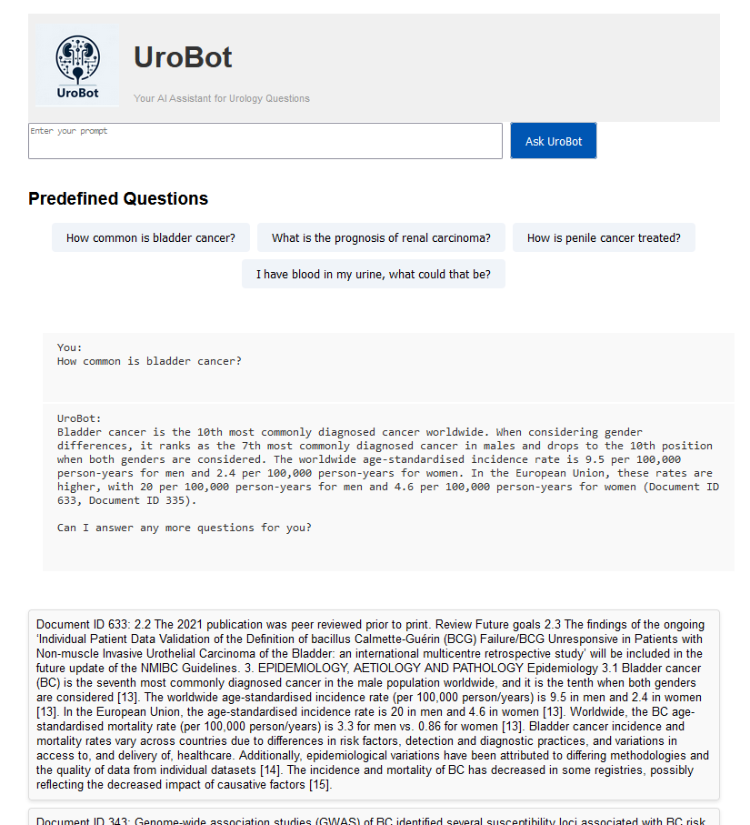

# UroBot
Urology-informed Large Language Model

UroBot is an advanced urology-specialized chatbot designed to enhance medical question-answering by leveraging the capabilities of large language models (LLMs) like GPT-3.5, GPT-4, and GPT-4o from OpenAI. Utilizing retrieval augmented generation (RAG) and the latest 2023 European Association of Urology (EAU) guidelines, UroBot aims to deliver accurate and explainable responses to urological board questions. In a comprehensive evaluation involving 200 European Board of Urology (EBU) In-Service Assessment (ISA) questions, UroBot-4o achieved a mean Rate of Correct Answers (RoCA) of 88.4%, significantly surpassing the performance of GPT-4o and typical urologists, with high consistency.



### How to Run the UroBot Flask App Locally

1. **Obtain OpenAI API Access**: 
   - Visit the [OpenAI API Quickstart Guide](https://platform.openai.com/docs/quickstart) and follow the instructions to get your API key.
   - Note: You will need to purchase credits to use the OpenAI API.

2. **Set Up the Environment**:
   - **Conda Users**: Create a conda environment using the `environment.yml` file:
     ```bash
     conda env create -f environment.yml
     conda activate your_env_name
     ```
   - **Pip Users**: Install the required packages from the `requirements.txt` file:
     ```bash
     pip install -r requirements.txt
     ```

3. **Run the Flask App**:
   - Execute the following command to start the application:
     ```bash
     flask --app UroBot_flask_app.py run
     ```
    
#### Citation

Hetz, M. J., Carl, N., Haggenmüller, S., Wies, C., Michel, M. S., Wessels, F., & Brinker, T. J. (2024). Superhuman performance in urology board questions by an explainable large language model enabled for context integration of the European Association of Urology guidelines: the UroBot study. arXiv preprint.